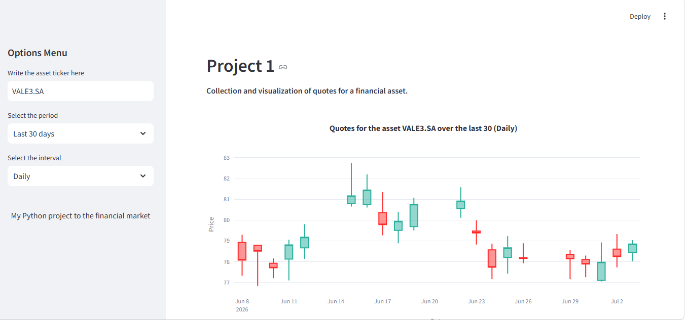

# Python-finances--project-1
My first project on finances using Python.

Here, in this project, I have created a new way to view information about a ticker on B3 or another stock exchange. Please be aware that all options are present on yfinance regarding the tickers. This project only shows the final, initial, maximum, and minimum prices for each ticker in each selected period. 

Note the example using ticker (VALE3.SA).

